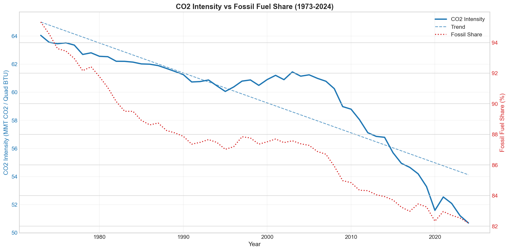
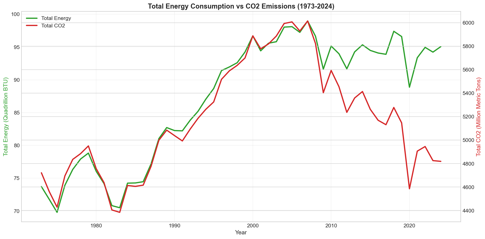
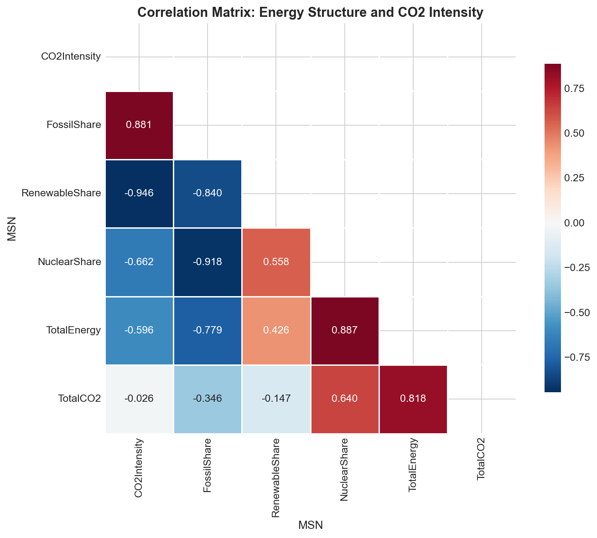
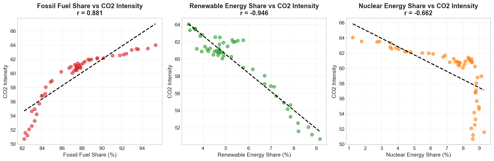
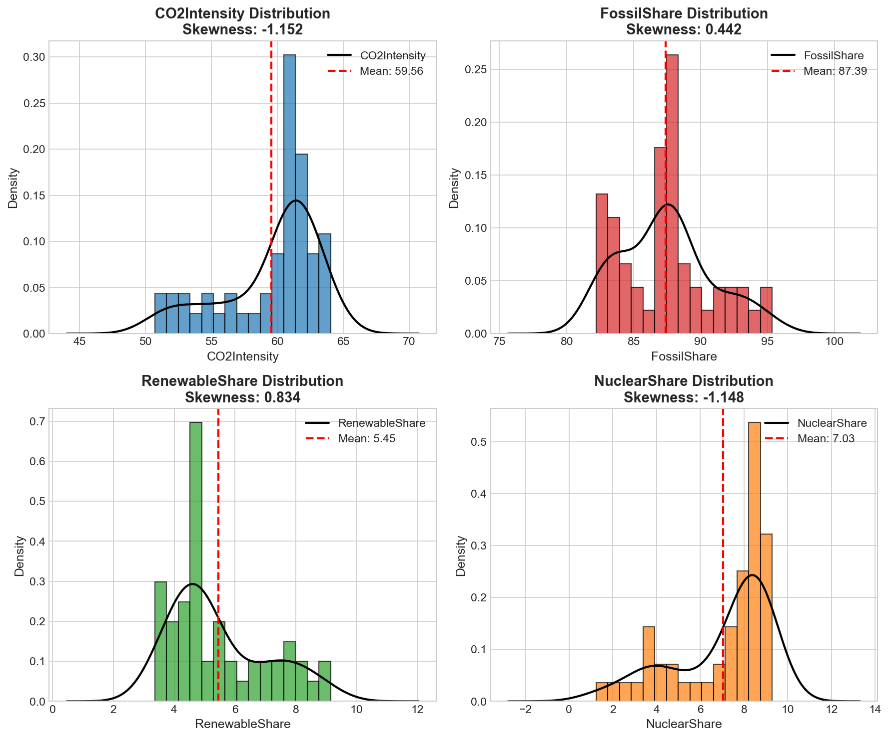
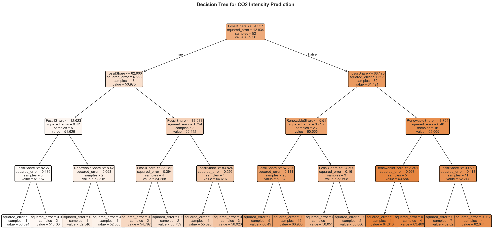
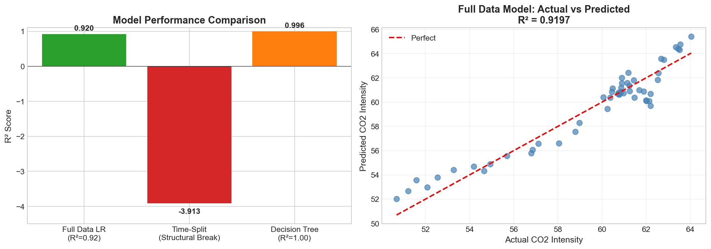
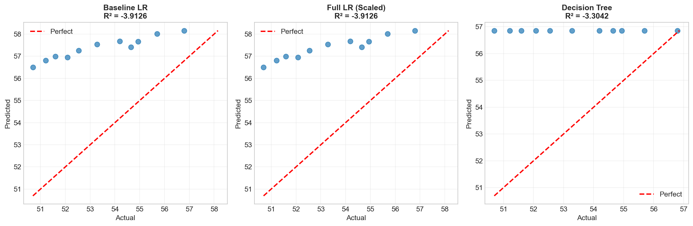
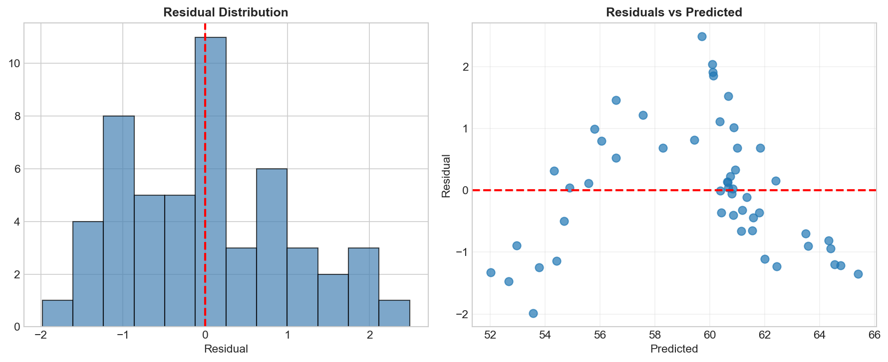
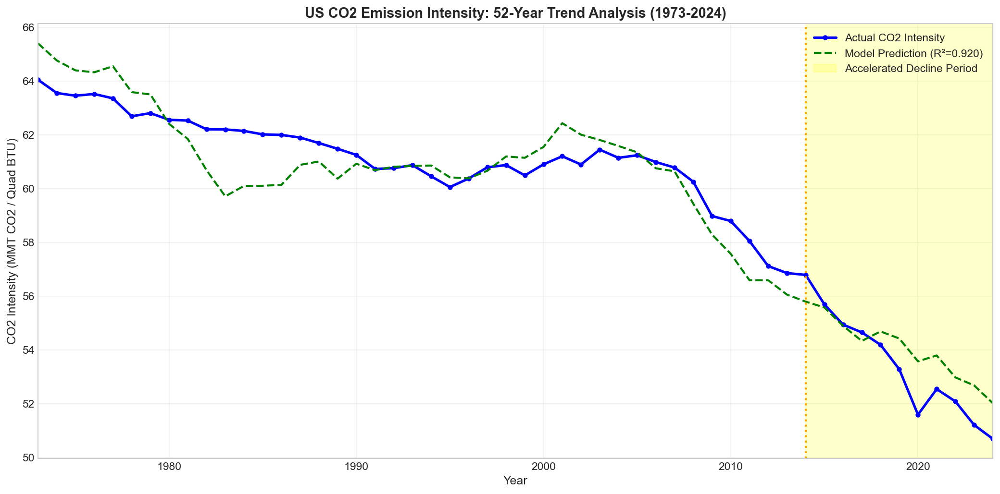

# Executive Summary | 执行摘要

## US Energy Structure and CO2 Emission Intensity Analysis
## 美国能源结构与二氧化碳排放强度分析

---

### Team | 团队
**Alan (Xiangyu Wu 吴翔宇) | Zheng Congyun 郑聪云 | He Yu 何雨 | Ma Shuting 马舒婷**

**Course | 课程:** CA6003 - Best Practices in Data Governance, Preparation and Analytics

**Institution | 机构:** Nanyang Technological University (NTU) | 南洋理工大学

---

## Research Question | 研究问题

**EN:** Does the change in US energy structure (fossil/renewable/nuclear shares) affect CO2 emission intensity?

**中文:** 美国能源结构的变化（化石燃料/可再生能源/核能占比）是否影响二氧化碳排放强度？

---

## Answer | 答案

### YES - Strong Relationship Confirmed | 是 - 确认存在强相关性

| Metric 指标 | Value 数值 |
|-------------|------------|
| Model R² 模型R² | **0.9197** (92% variance explained 方差解释率92%) |
| Fossil → CO2 化石能源→CO2 | r = **+0.881** (strong positive 强正相关) |
| Renewable → CO2 可再生能源→CO2 | r = **-0.946** (very strong negative 极强负相关) |

---

## Key Results | 主要结果

### 52-Year Change (1973-2024) | 52年变化（1973-2024）

| Metric 指标 | 1973 | 2024 | Change 变化 |
|-------------|------|------|-------------|
| Fossil Share 化石能源占比 | 95.3% | 82.2% | **-13.1%** |
| Renewable Share 可再生能源占比 | 3.4% | 9.2% | **+5.8%** |
| Nuclear Share 核能占比 | 1.2% | 8.6% | +7.4% |
| CO2 Intensity CO2强度 | 64.05 | 50.69 | **-20.8%** |

### Model Interpretation | 模型解释

**EN:**
- 1% increase in Fossil Share → +0.31 increase in CO2 Intensity
- 1% increase in Renewable Share → -1.60 decrease in CO2 Intensity
- **Renewables have 5x greater impact than fossil fuel reduction**

**中文:**
- 化石能源占比每增加1% → CO2强度增加0.31
- 可再生能源占比每增加1% → CO2强度降低1.60
- **可再生能源的影响是化石燃料减少影响的5倍**

---

## Critical Data Governance Discovery | 关键数据治理发现

### Structural Break (2014) | 结构性断裂（2014年）

**EN:**
Models trained on 1973-2013 data **underestimate** the CO2 decline after 2014. CO2 intensity dropped **faster** than historical patterns predicted. This reveals accelerating decarbonization.

**中文:**
基于1973-2013年数据训练的模型**低估了**2014年后的CO2下降。CO2强度的下降**快于**历史模式预测。这揭示了加速脱碳的趋势。

**Causes | 原因:**
- Rapid renewable adoption | 可再生能源快速普及
- Coal plant retirements | 煤电厂退役
- Policy changes (Paris Agreement) | 政策变化（巴黎协定）

**Lesson | 经验:**
Time-based train/test splits can reveal structural changes that random splits would hide.
基于时间的训练/测试拆分可以揭示随机拆分会隐藏的结构性变化。

---

## Data Governance Issues Addressed | 已处理的数据治理问题

| Issue 问题 | Solution 解决方案 |
|------------|-------------------|
| String data types 字符串数据类型 | Convert to numeric 转换为数值 |
| "Not Available" values "Not Available"值 | Handle as NaN 处理为NaN |
| Mixed granularity 混合粒度 | Filter to annual only 仅保留年度数据 |
| Multicollinearity 多重共线性 | Use subset of predictors 使用预测变量子集 |

---

## Visualizations | 可视化图表

### Fig 1: Energy Structure Evolution | 能源结构演变

**EN:** Stacked area chart showing US energy mix from 1973-2024. Fossil fuels (red) declined from 95% to 82%, while renewables (green) grew from 3% to 9%. Nuclear (orange) stabilized around 8% since 1990s.

**中文:** 堆叠面积图展示1973-2024年美国能源结构。化石燃料（红色）从95%下降到82%，可再生能源（绿色）从3%增长到9%。核能（橙色）自1990年代以来稳定在8%左右。

---

### Fig 2: CO2 Intensity Trend | CO2强度趋势

**EN:** Dual-axis chart showing CO2 intensity (blue) declining alongside fossil fuel share (red dotted). Clear downward trend with acceleration after 2014.

**中文:** 双轴图显示CO2强度（蓝色）与化石燃料占比（红色虚线）同步下降。明显的下降趋势，2014年后加速。

---

### Fig 3: Energy vs CO2 Decoupling | 能源与CO2脱钩

**EN:** Shows decoupling phenomenon - total energy consumption (green) remained stable since 2007, while CO2 emissions (red) declined. This indicates improved energy efficiency and cleaner energy mix.

**中文:** 显示脱钩现象——总能源消耗（绿色）自2007年以来保持稳定，而CO2排放（红色）下降。这表明能源效率提高和能源结构更清洁。

---

### Fig 4: Correlation Matrix | 相关矩阵

**EN:** Heatmap showing correlations between variables. Key findings: Fossil share strongly positively correlated with CO2 intensity (+0.88), Renewable share strongly negatively correlated (-0.95).

**中文:** 热力图显示变量之间的相关性。主要发现：化石能源占比与CO2强度强正相关（+0.88），可再生能源占比强负相关（-0.95）。

---

### Fig 5: Scatter Plots with Regression | 散点图与回归线

**EN:** Three scatter plots showing relationship between each energy share and CO2 intensity. Regression lines confirm: higher fossil = higher CO2 intensity; higher renewable = lower CO2 intensity.

**中文:** 三个散点图显示每种能源占比与CO2强度的关系。回归线确认：化石能源越高=CO2强度越高；可再生能源越高=CO2强度越低。

---

### Fig 6: Variable Distributions | 变量分布

**EN:** Histograms with KDE showing distribution of key variables. Used to check for skewness and normality assumptions before modeling.

**中文:** 带核密度估计的直方图显示关键变量的分布。用于在建模前检查偏度和正态性假设。

---

### Fig 7: Outlier Detection | 异常值检测

**EN:** Box plots for outlier detection using IQR method. Most variables show no significant outliers, indicating data quality is acceptable.

**中文:** 使用IQR方法的箱线图进行异常值检测。大多数变量没有显著异常值，表明数据质量可接受。

---

### Fig 8: Decision Tree | 决策树

**EN:** Decision tree visualization showing how the model splits data. Fossil share is the primary splitting variable, confirming its importance in predicting CO2 intensity.

**中文:** 决策树可视化显示模型如何拆分数据。化石能源占比是主要拆分变量，确认其在预测CO2强度中的重要性。

---

### Fig 9: Model Comparison | 模型比较

**EN:** Bar charts comparing model performance. Full data models achieve high R² (0.92), while time-split test shows negative R² due to structural break - a key data governance insight.

**中文:** 柱状图比较模型性能。全数据模型达到高R²（0.92），而时间拆分测试由于结构性断裂显示负R²——这是关键的数据治理洞察。

---

### Fig 10: Actual vs Predicted | 实际值与预测值

**EN:** Scatter plots comparing actual vs predicted values for each model. Points close to diagonal line indicate good predictions.

**中文:** 散点图比较每个模型的实际值与预测值。点越接近对角线表示预测越准确。

---

### Fig 11: Residual Analysis | 残差分析

**EN:** Left: Residual distribution (should be centered at 0). Right: Residuals vs predicted (should show no pattern). Used to validate model assumptions.

**中文:** 左：残差分布（应以0为中心）。右：残差与预测值（应无明显模式）。用于验证模型假设。

---

### Fig 12: Final Summary | 最终摘要

**EN:** Complete trend analysis showing actual CO2 intensity (blue), model prediction (green dashed), and highlighted structural break period (yellow, 2014-2024) where decline accelerated beyond model predictions.

**中文:** 完整趋势分析显示实际CO2强度（蓝色）、模型预测（绿色虚线）和突出显示的结构性断裂期间（黄色，2014-2024），该期间下降速度超出模型预测。

---

## Conclusions | 结论

### Research Answer | 研究答案

**Does US energy structure change affect CO2 emission intensity?**
**美国能源结构变化是否影响CO2排放强度？**

## **YES - Significant Impact Confirmed | 是的 - 确认存在显著影响**

---

### Key Findings | 主要发现

#### 1. Quantitative Results | 定量结果

| Metric 指标 | 1973 | 2024 | Change 变化 |
|-------------|------|------|-------------|
| Fossil Share 化石能源占比 | 95.3% | 82.2% | **-13.1%** |
| Renewable Share 可再生能源占比 | 3.4% | 9.2% | **+5.8%** |
| CO2 Intensity CO2强度 | 64.05 | 50.69 | **-20.8%** |

#### 2. Correlation Analysis | 相关性分析

- **Fossil → CO2 Intensity 化石能源→CO2强度:** r = **+0.881** (strong positive 强正相关)
- **Renewable → CO2 Intensity 可再生能源→CO2强度:** r = **-0.946** (very strong negative 极强负相关)
- **Model R² 模型R²:** **0.9197** (explains 92% of variance 解释92%的变异)

#### 3. Key Insight | 关键洞察

**Renewables have 5x greater impact than fossil fuel reduction:**
**可再生能源的影响是化石燃料减少的5倍：**

- 1% ↑ Fossil Share → +0.31 ↑ CO2 Intensity
  化石能源占比增加1% → CO2强度增加0.31
- 1% ↑ Renewable Share → **-1.60** ↓ CO2 Intensity
  可再生能源占比增加1% → CO2强度降低1.60

#### 4. Data Governance Discovery | 数据治理发现

**Structural Break (2014) | 结构性断裂（2014年）**

After 2014, CO2 intensity declined **faster** than historical models predicted.
2014年后，CO2强度下降速度**超出**历史模型预测。

**Causes | 原因:**
- Renewable energy technology breakthroughs | 可再生能源技术突破
- Large-scale coal plant retirements | 煤电厂大规模退役
- Policy drivers (Paris Agreement) | 政策推动（巴黎协定）

---

### Final Summary | 最终总结

#### EN:
1. **Energy transition is effective** — Shifting from fossil fuels to renewables reduced CO2 intensity by 20.8% over 52 years
2. **Renewables are more efficient** — Increasing renewable share has greater impact on reducing CO2 than reducing fossil share
3. **Data governance matters** — Proper data processing and time series analysis revealed the accelerating decarbonization trend after 2014

#### 中文:
1. **能源转型有效** — 从化石燃料转向可再生能源，52年间CO2强度降低了20.8%
2. **可再生能源更高效** — 增加可再生能源比减少化石燃料对降低CO2的效果更显著
3. **数据治理很重要** — 通过正确的数据处理和时间序列分析，发现了2014年后的加速脱碳趋势

---

### One-Sentence Conclusion | 一句话结论

**EN:** The US energy transition towards renewables has significantly reduced CO2 emission intensity, and this trend accelerated after 2014.

**中文:** 美国能源结构向可再生能源转型显著降低了CO2排放强度，且这一趋势在2014年后加速。

---

## Caveats | 注意事项

- Correlation ≠ Causation | 相关性 ≠ 因果关系
- Confounders exist: GDP, technology, policy | 存在混杂因素：GDP、技术、政策
- Time series autocorrelation present | 存在时间序列自相关

---

## Data Source | 数据来源

**U.S. Energy Information Administration (EIA) Monthly Energy Review**
**美国能源信息署（EIA）月度能源报告**

- Energy: Table 1.1 (1949-2025) | 能源：表1.1
- CO2: Table 11.1 (1973-2025) | CO2：表11.1
- Analysis Period: 1973-2024 (52 years) | 分析期间：1973-2024（52年）
